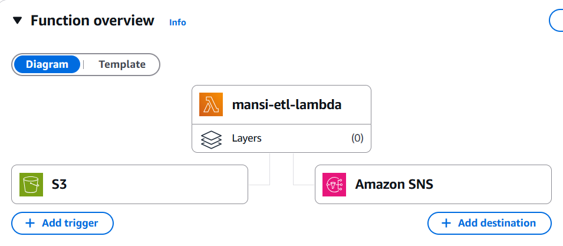
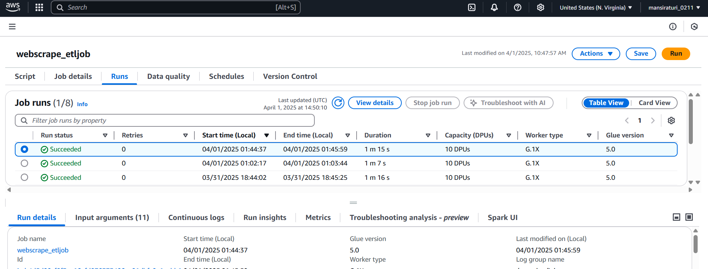
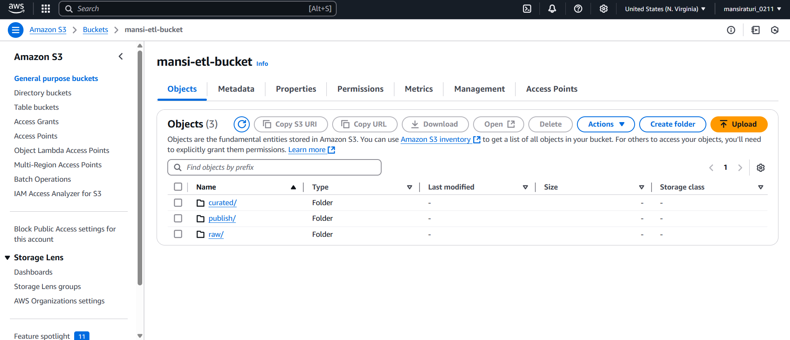
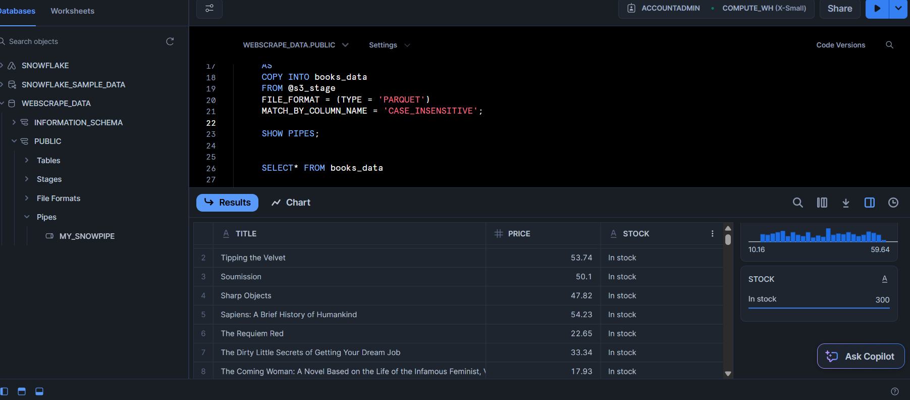
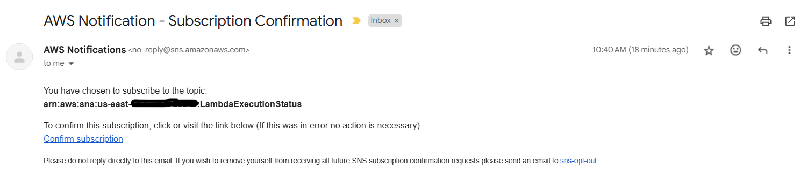

# SnowScraper: Web Scraping Data ETL Pipeline with Snowpipe

## Purpose
This project sets up a serverless ETL pipeline for web scraping data, storing it in an S3 bucket, processing the data using AWS Glue, and loading it into Snowflake using Snowpipe. The objective is to create a fully automated, scalable, and efficient data pipeline to process and load web-scraped data into Snowflake for analytics and reporting.

## Architecture Overview
The pipeline follows these steps:

1. **Web Scraping**: Data is scraped from a website, processed into CSV format, and stored in an S3 bucket (raw data)
2. **AWS Lambda**: A Lambda function automatically triggers whenever a new file is uploaded to S3
3. **AWS Glue**: Glue jobs process the CSV files into Parquet format for efficient querying
4. **Snowpipe**: A Snowflake Snowpipe is used to automatically load the transformed data into Snowflake tables

## Components Used
- **Web Scraping**: Python scripts or frameworks like BeautifulSoup and requests to extract data from websites
- **AWS S3**: Cloud storage for raw and processed files
- **AWS Lambda**: Serverless function to automate actions (e.g., move files to Curated layer and trigger Glue job)
- **AWS Glue**: Managed ETL service to transform and load data into Parquet format
- **Snowpipe & Snowflake**: Snowpipe automatically loads the transformed data into Snowflake for querying

## Steps Involved

### 1. Web Scraping (External Source)
#### Set up Web Scraping:
- Write a Python script using BeautifulSoup, requests, or Selenium to scrape data from a website
- Store the scraped data as CSV files
- Upload the scraped files into an S3 bucket

### 2. S3 Bucket Setup
- Create an S3 Bucket to store raw data
- **File Format**: The scraped data is saved as CSV files, stored in a `raw/` directory within the S3 bucket

### 3. AWS Lambda Trigger Setup
#### Create Lambda Function:
- The Lambda function is triggered when a new file is uploaded to the S3 bucket
- The function moves the file from `raw/` to `curated/` folder in S3 and triggers an AWS Glue job to process the file
- **Permissions**: Ensure that the Lambda function has permissions to read from the raw S3 bucket and write to the curated folder in the same S3 bucket. Also, Lambda needs permission to trigger the Glue job
 

#### Set Up Event Trigger:
- Create an S3 event notification to trigger the Lambda function when a new file is uploaded

### 4. AWS Glue Setup
#### Create a Glue Job:
- Set up a Glue job that reads the CSV files from the `curated/` folder in S3, processes them (e.g., convert CSV to Parquet format), and writes the transformed data back to S3 in the `publish/` folder
- The Glue job script (`csvtoparquet.py`) processes the data
- **Permissions**: Ensure that the Glue job has read and write permissions to the appropriate S3 buckets (curated and publish)

### 5. Snowpipe Setup
#### Create Snowpipe in Snowflake:
- Use Snowpipe to automatically load data from the `publish/` folder in S3 into Snowflake tables

#### Set up Snowflake's IAM Role:
- Grant the Snowpipe role permission to access the S3 bucket
- Ensure Snowpipe is set up to automatically ingest data from the `publish/` folder into Snowflake tables

### 6. Snowflake Setup
- **Create Table**: Create a table in Snowflake to hold the processed data
- **Create Stage**: Create an external stage pointing to your S3 bucket where the processed files (Parquet) are stored

After the above steps are set up, whenever a new file is uploaded to the S3 bucket, the Lambda function will be triggered, which will move the file to the `curated/` folder and trigger the Glue job. The Glue job will process the data and write it to the `publish/` folder in S3. Snowpipe will automatically load the data from the `publish/` folder into Snowflake.

 

The subscriber gets notified about the lambda execution status
 

## Conclusion
This pipeline automates the process of extracting, transforming, and loading (ETL) data from a web scraping job into Snowflake for further analysis. The combination of AWS Lambda, AWS Glue, Snowpipe, and Snowflake enables a fully managed, scalable, and serverless ETL pipeline.

